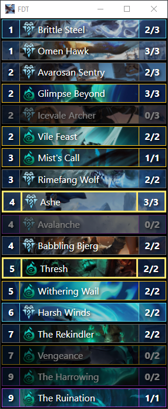

# Fleetfeather Deck Tracker

Legends Of Runeterra Deck Tracker made with Electron and React for learning purposes.

## Features
* Automatic game start detection
* Manual override for bad detections or insertions into deck (left-click and right-click)
* Always up to date
* Ability to change port (to-do)



## Installation
Download the release or build from source:
```
yarn build
yarn package
```

## Legal
LoR Database Builder was created under Riot Games' "Legal Jibber Jabber" policy using assets owned by Riot Games.  Riot Games does not endorse or sponsor this project.


